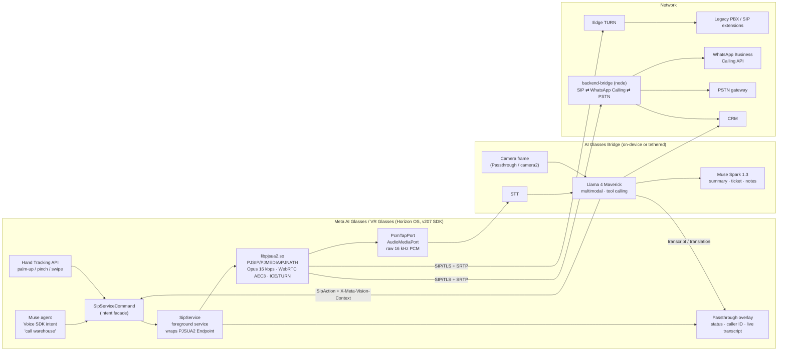

# Glasses-First AI Receptionist & Field Calling — Architecture

Proof of concept: make Meta AI Glasses / VR Glasses a **native SIP endpoint**
built on PJSIP (PJSUA2), not a Bluetooth accessory of a phone. The glasses
register, place and answer calls themselves; an AI bridge (Llama 4 Maverick)
sits on the media path for transcription, translation, vision context and
after-call agentic work (Muse Spark).

All code in this tree is a scaffold: interfaces are shaped to the v207
Horizon OS SDK surfaces (Passthrough API, Hand Tracking API, Voice SDK) but
the SDK itself is not vendored. Everything on the PJSIP side is real PJSUA2
API and builds with the normal `configure-android` + SWIG toolchain.

## 1. System diagram



Plain-text version of the same picture:

```
 Glasses (Horizon OS + v207 SDK + PJSUA2)
 ┌───────────────────────────────────────────────┐
 │ Voice SDK ─┐                                  │
 │ Hand Track ┼─▶ SipServiceCommand ─▶ SipService│──SIP/TLS+SRTP──▶ edge TURN ─▶ PBX
 │ Passthrough◀── call events / transcript       │──SIP/TLS+SRTP──▶ backend-bridge ─▶ WhatsApp Calling / PSTN
 │                 │                             │
 │            libpjsua2.so ──▶ PcmTapPort ───────┼──raw PCM──▶ STT ─▶ Llama 4 Maverick ◀── camera frame
 └───────────────────────────────────────────────┘                        │
                                                          SipAction (+X-Meta-Vision-Context) / transcript / Spark tasks
```

## 2. Components

| Layer | Path | What it is | Maps to |
|---|---|---|---|
| Glasses client | `src/glasses-client/` | Android/Horizon OS app: `SipService` (foreground service owning the PJSUA2 `Endpoint`), `SipServiceCommand` (static intent facade, same idea as VoiSmart pjsip-android), `GlassesAccount`/`GlassesCall` (PJSUA2 subclasses), `PcmTapPort` (`AudioMediaPort` subclass), voice trigger receiver, hand-gesture handler stub, passthrough overlay stub | v207 Voice SDK, Hand Tracking API, Passthrough API |
| PJSIP native | `src/pjsip-native/` | `build-android.sh` (configure-android + SWIG), `config_site.h` tuned for glasses, codec/EC profile notes | Android NDK r26+, Horizon OS arm64-v8a |
| AI bridge | `src/ai-vision-call/` | `getCameraFrame()` + `getAudioPCM()` → STT → Llama 4 Maverick (tool calling) → `SipAction` → `SipServiceCommand`. Includes translation loop and Spark after-call hooks | Llama API, Muse Spark |
| Backend bridge | `src/backend-bridge/` | Node service: routes a glasses call to WhatsApp Business Calling API (Multi-Solution Conversations) or PSTN/PBX; carries `X-Meta-Vision-Context` into CRM | WhatsApp Cloud API, PJSIP gateway |
| Demo scenarios | `src/demo-scenarios/` | Three runnable scripts driving the above via `adb` + a `pjsua`/linphone peer | — |

### Why a service and not an Activity

Horizon OS apps get suspended aggressively when the visor is off or the user
switches immersive apps. The `Endpoint` must outlive the UI: it lives in a
foreground service with `foregroundServiceType="phoneCall|microphone"`, owns a
single `HandlerThread` on which **every** PJSUA2 call is made (PJSUA2 requires
registered threads and is not re-entrant from arbitrary threads), and exposes a
narrow command surface via intents. The overlay, Muse and the gesture handler
never touch PJSUA2 directly.

### Threading and locking (important for reviewers)

- `SipService.worker` is the only thread that calls into PJSUA2. It is the
  thread that runs `libCreate()`, so it is auto-registered.
- PJSUA2 callbacks (`onCallState`, `onCallMediaState`, `onIncomingCall`) run
  on PJSUA's own worker thread while holding PJSUA_LOCK. They only post
  events; they never block or call back into the service synchronously.
- `PcmTapPort.onFrameReceived()` runs on the conference-bridge clock thread
  every 20 ms. It copies the frame into a lock-free queue and returns. No
  JNI-heavy work, no logging, no allocation beyond the copy.

## 3. Call flows

### 3.1 Voice trigger → SIP INVITE ("Hey Meta, call warehouse")

```
Muse / Voice SDK        VoiceTriggerReceiver     ContactResolver      SipServiceCommand    SipService (worker)      PJSIP
     │ intent CALL_CONTACT      │                     │                    │                      │                  │
     │ name="warehouse"         │                     │                    │                      │                  │
     ├─────────────────────────▶│ resolve("warehouse")│                    │                      │                  │
     │                          ├────────────────────▶│ CRM/local dir      │                      │                  │
     │                          │◀────────────────────┤ sip:2001@pbx       │                      │                  │
     │                          │ makeCall(uri, ctx)  │                    │                      │                  │
     │                          ├────────────────────────────────────────▶│ ACTION_MAKE_CALL     │                  │
     │                          │                     │                    ├─────────────────────▶│ Call.makeCall()  │
     │                          │                     │                    │                      ├─────────────────▶│ INVITE
     │                          │                     │                    │                      │◀── onCallState ──┤ 180/200
     │  overlay: "Calling Warehouse…" ◀──────────────────────────────────── broadcast CALL_STATE ─┤                  │
```

### 3.2 See-what-I-see support call (vision context)

1. Technician: "call support for this". Muse intent carries `vision=true`.
2. `ai-vision-call` grabs `getCameraFrame()` (Passthrough camera on VR
   Glasses, camera2 on camera-equipped AI Glasses; **not available on Luna**
   which is camera-free — falls back to text-only intent).
3. Llama 4 Maverick receives frame + "identify the machine, pick the SIP
   extension for its support queue" with tools `crm_lookup` and `sip_call`.
4. Result is a `SipAction { type: "call", target: "sip:support-cnc@pbx",
   headers: { "X-Meta-Vision-Context": "<json: model, serial, fault>" } }`.
5. `SipService` injects the header via `CallOpParam.txOption.headers`.
   The PBX / backend bridge reads it to route and to pre-populate the ticket.

### 3.3 Inbound SIP → glasses answers, live transcript in passthrough

1. `GlassesAccount.onIncomingCall()` creates a `GlassesCall`, replies 180,
   broadcasts `INCOMING_CALL` with caller ID resolved from CRM.
2. Overlay shows "Incoming: Priya (Warehouse)". Hand Tracking: palm-up →
   `SipServiceCommand.answer()`; pinch → mute; swipe → transfer.
3. On `onCallMediaState`, the service wires: capture→call, call→playback,
   **and** call→`farTap`, capture→`nearTap`.
4. Taps stream PCM to `ai-vision-call`, which runs STT and pushes transcript
   lines to the overlay; optional Llama translation loop (EN ⇄ HI).

## 4. Media path details

- Codec: Opus, 16 kHz, 20 ms ptime (40 ms optional for radio power), 16 kbps
  VBR, complexity 4, FEC with 10 % expected loss. Set via
  `Endpoint.setCodecOpusConfig()`; PCMU/PCMA kept as fallback for PBXs.
- Echo: glasses have open-ear speakers a few cm from the mics, so the echo
  path is short but loud. Use WebRTC AEC3 with noise suppression and AGC
  (`PJMEDIA_ECHO_WEBRTC_AEC3 | USE_NOISE_SUPPRESSOR | USE_GAIN_CONTROLLER`,
  tail 200 ms). Build with `--enable-libwebrtc-aec3`.
- Conference bridge runs at 16 kHz to match glasses mics and avoid a
  resample stage; `PJSUA_DEFAULT_SND_USE_SW_CLOCK` stays on (Android
  default) for stable RTP timing.
- Raw PCM tap: `AudioMediaPort` registered on the bridge (see `PcmTapPort`).
  Alternative for on-device AI without leaving native code: the experimental
  `pjmedia_ai_port` (`pjmedia/include/pjmedia/ai_port.h`) with a Llama
  backend implementing `pjmedia_ai_backend_op`. The OpenAI backend in
  `ai_port_openai.c` is the template.
- Video (VR Glasses only): optional H.264 via `--enable-video`; passthrough
  camera → `VidDevManager` capture. Not needed for the three demos.

## 5. Glasses constraints and how the scaffold handles them

### Battery

| Problem | Mitigation in this scaffold |
|---|---|
| SIP keepalives wake the radio | TLS transport with TCP keepalive at 90 s; registration expiry 600 s; no UDP NAT keepalive when TLS is used (`PJSUA_ACC` `ka_interval`=0). |
| Always-on media path | Sound device auto-closed 2 s after last call (`sndAutoCloseTime`); no local preview; VAD on the tap to skip silence upstream. |
| Opus CPU | complexity 4, 16 kHz, single channel; hardware AEC where the audio HAL exposes it (`PJMEDIA_ECHO_USE_SW_ECHO` off by default so the platform AEC is tried first). |
| AI inference | PCM leaves the device only while a call is active; Llama calls are turn-based (utterance-level), not per-frame. Vision frames sent once per intent, downscaled to 512 px. |
| Background survival | Foreground service + `phoneCall` type; push-to-wake (SIP over TLS with the OS-managed socket keepalive) is the long-term answer, not a wake lock. |

### Network

| Problem | Mitigation |
|---|---|
| Wi-Fi ⇄ tether handoff mid-call | ICE enabled, edge TURN (`turnEnabled`, TLS to 443) so a path always exists; `Account.setRegistration(true)` on connectivity change, then `Call.reinvite()` with updated transport (see `SipService.onNetworkChanged`). |
| Bluetooth audio route (tethered AI Glasses) | `AudioRouter` sets `MODE_IN_COMMUNICATION` and `setCommunicationDevice()` to the glasses BT SCO/LE-Audio device before the sound device opens; PJSUA2's Android JNI backend inherits the route. |
| Symmetric NAT / carrier NAT | TURN over TLS 443, `contactRewriteUse=1`, `viaRewriteUse=1`. |
| Small MTU on tethers | Opus 16 kbps keeps RTP under 100 B/pkt; SIP over TLS avoids UDP fragmentation of large INVITEs (vision header). |

### Vision header size

`X-Meta-Vision-Context` is a compact JSON, capped at 1 KB by the bridge.
Larger context (frame thumbnail, OCR text) goes to the backend bridge via
HTTPS and is referenced by a `ctx_id` in the header.

## 6. Open questions for the real Horizon OS port

- Does v207 expose a foreground-service equivalent that keeps sockets alive
  with the visor off, or must the SIP endpoint move to a tethered phone when
  the glasses sleep?
- Passthrough camera access for third-party apps: the scaffold assumes a
  `CameraFrameSource` interface; on VR Glasses this is the Passthrough
  Camera API, on AI Glasses the DAT (Device Access Toolkit) stream.
- Muse intent schema: `VoiceTriggerReceiver` accepts a generic
  `org.pjsip.glasses.action.VOICE_INTENT` with `intent`, `slot_name`,
  `vision` extras; swap for the real Muse `Intent` contract when published.
